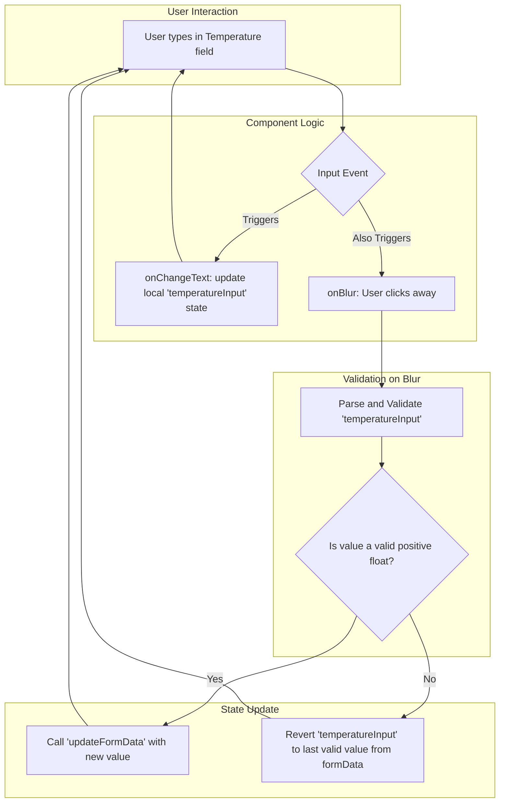

### Refactoring Plan: `components/development-recipes/recipe-steps/DevelopmentParamsStep.tsx`

The goal is to improve the form's usability by validating inputs `onBlur` rather than `onChange`. This ensures users can freely type, especially decimal values, without the input unexpectedly reverting. The existing "local state, commit on blur" pattern from the `shootingIso` field will be applied to the `temperature` and `development time` fields.

#### 1. The Problem: Aggressive `onChange` Validation

The `temperatureF` and `timeMinutes` inputs currently update the parent form's state on every keystroke. The `parseFloat(v) || defaultValue` logic inside `onChangeText` can interrupt the user. For example, when a user types "7.5", the input is first parsed as `7` when they type the decimal point, which can cause a jarring UI update before they can finish entering the number.

**Current (Problematic) Code:**
```tsx
<NumberInput
  value={String(formData.temperatureF)}
  onChangeText={v => updateFormData({ temperatureF: parseFloat(v) || 68 })}
  placeholder="68"
/>
```

#### 2. The Solution: Validate on Blur

The following changes will be implemented:

1.  **Introduce Local State:** Create local state variables within `DevelopmentParamsStep` to store the raw string input for temperature and time as the user types.
    *   `const [temperatureInput, setTemperatureInput] = useState(String(formData.temperatureF));`
    *   `const [timeInput, setTimeInput] = useState(String(formData.timeMinutes));`

2.  **Update Input Handlers:** The `NumberInput` components will be modified:
    *   `onChangeText` will now only update the local string state (e.g., `setTemperatureInput`).
    *   A new `onBlur` handler will be added to parse, validate, and commit the final value to the parent form state using `updateFormData`.

3.  **Implement Validation Logic:** The `onBlur` handlers will:
    *   Parse the input string to a floating-point number.
    *   Check if the result is a valid, positive number.
    *   If valid, call `updateFormData`.
    *   If invalid (e.g., empty or non-numeric), revert the input to the last known valid value from `formData` to ensure UI consistency.

4.  **Synchronize with Props:** `useEffect` hooks will be added to keep the local input state synchronized with the `formData` prop. This handles cases where the form data is changed externally, for instance, by loading a recipe preset.

#### Visualizing the New Logic



#### 3. Summary of Changes

This refactoring will:
*   **Fix the user experience issue** by allowing uninterrupted typing.
*   **Improve validation** to correctly handle positive floating-point numbers.
*   **Align all form fields** to a consistent and robust validation strategy (`onBlur`).
*   **Maintain architectural consistency** by extending an existing pattern within the component rather than introducing a large, new library unnecessarily.