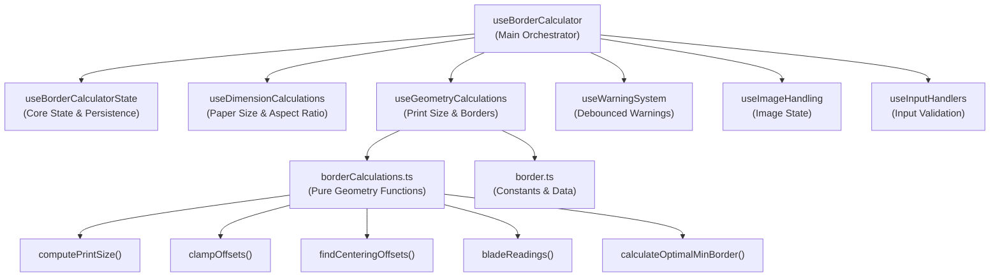
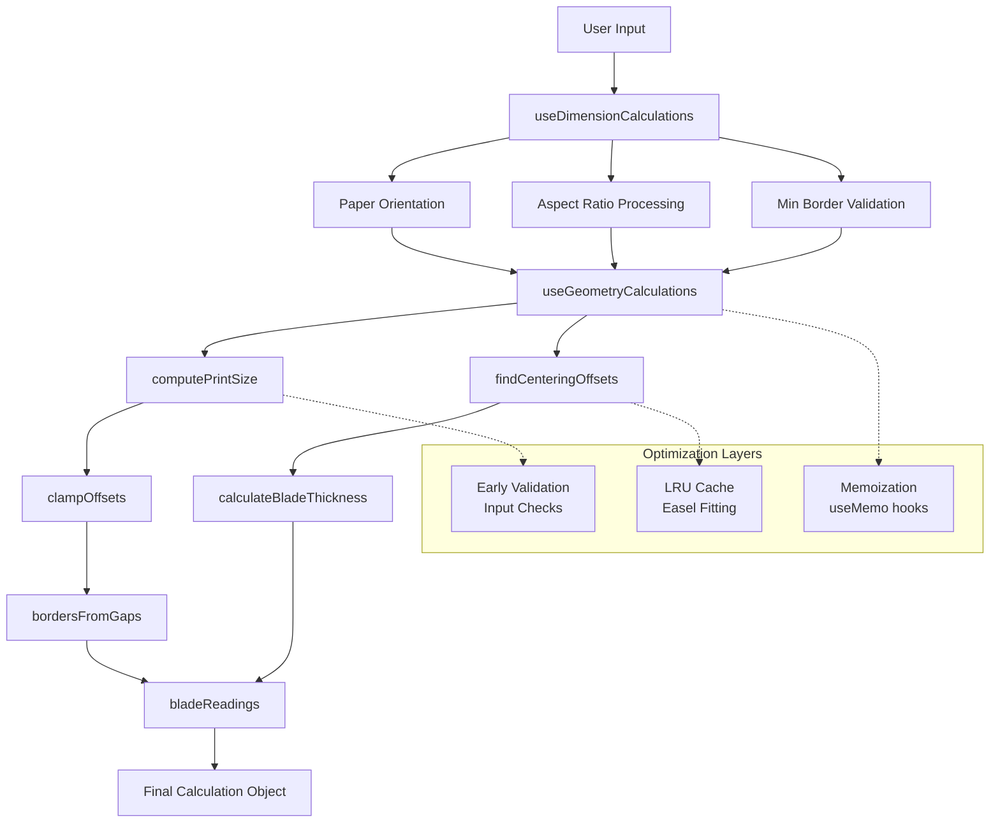

# Border Calculator Formulas and Algorithms

## Introduction

The Border Calculator is a tool for calculating optimal print sizes and borders for darkroom printing. It helps determine proper dimensions, borders, and blade positions for easel trimming while maintaining desired aspect ratios. The calculator uses a modular React hook architecture with pure geometry helper functions optimized for performance and maintainability.

## Architecture Overview

### Modular Hook Architecture

The calculator follows a modular architecture separating concerns into specialized hooks:

- **`useBorderCalculator`** - Main orchestrating hook that composes all sub-hooks
- **`useBorderCalculatorState`** - Core state management and persistence
- **`useDimensionCalculations`** - Paper size, aspect ratio, and orientation calculations  
- **`useGeometryCalculations`** - Print size, borders, blade readings, and easel fitting
- **`useWarningSystem`** - Debounced warning management to prevent flashing
- **`useImageHandling`** - Image-related state and operations
- **`useInputHandlers`** - Input validation and debounced field handlers

### Data Flow Architecture



### Performance Optimizations

The current implementation includes several performance optimizations:

- **Memoized Calculations**: All expensive calculations are memoized with optimized dependency arrays
- **LRU Caching**: Easel fitting calculations use a 50-item LRU cache for paper size lookups
- **Early Validation**: Input validation occurs before expensive calculations
- **Optimized Lookup Tables**: O(1) paper size and aspect ratio lookups using pre-computed maps
- **Adaptive Algorithms**: Binary search and adaptive step sizing for border optimization

## Core Formulas

### Print Size Calculation

The print size is calculated based on the paper dimensions, minimum border requirement, and desired aspect ratio.

**Function**: `computePrintSize(w, h, rw, rh, mb)` - *Optimized with early validation*

Given:

- Paper dimensions: $W_p \times H_p$ (oriented based on landscape setting)
- Minimum border: $B_{min}$
- Aspect ratio: $R = W_r / H_r$

**Optimization**: Early validation prevents unnecessary calculations:

```typescript
// Early validation to avoid unnecessary calculations
if (rh <= 0 || w <= 0 || h <= 0 || mb < 0) {
  return { printW: 0, printH: 0 };
}

const availW = w - 2 * mb;
const availH = h - 2 * mb;

if (availW <= 0 || availH <= 0) {
  return { printW: 0, printH: 0 };
}
```

Available print area:

- Available width: $W_a = W_p - 2 \times B_{min}$
- Available height: $H_a = H_p - 2 \times B_{min}$

Print dimensions are determined by comparing the available area ratio to the desired ratio:

```typescript
const ratio = rw / rh;
const availRatio = availW / availH;

// Single comparison with cached ratio for efficiency
if (availRatio > ratio) {
  const printH = availH;
  return { printW: printH * ratio, printH };
} else {
  const printW = availW;
  return { printW, printH: printW / ratio };
}
```

### Offset Handling and Clamping

**Function**: `clampOffsets(paperW, paperH, printW, printH, mb, offH, offV, ignoreMB)`

The calculator computes the maximum allowed offsets and clamps user input accordingly:

```javascript
const halfW = (paperW - printW) / 2;  // Half the horizontal gap
const halfH = (paperH - printH) / 2;  // Half the vertical gap

// Maximum offsets depend on ignore minimum border setting
const maxH = ignoreMB ? halfW : Math.min(halfW - mb, halfW);
const maxV = ignoreMB ? halfH : Math.min(halfH - mb, halfH);

// Clamp the offsets
const h = Math.max(-maxH, Math.min(maxH, offH));
const v = Math.max(-maxV, Math.min(maxV, offV));
```

Warning messages are generated when offsets are clamped:

- If `ignoreMB` is true: "Offset adjusted to keep print on paper."
- Otherwise: "Offset adjusted to honour min‑border."

### Border Calculation

**Function**: `bordersFromGaps(halfW, halfH, h, v)`

Borders are calculated from the gap halves and applied offsets:

```javascript
borders = {
  left: halfW - h,
  right: halfW + h,
  bottom: halfH - v,
  top: halfH + v
}
```

Where:

- `h` is the clamped horizontal offset (positive = shift right)
- `v` is the clamped vertical offset (positive = shift up)

### Easel Size Determination

**Function**: `findCenteringOffsets(paperW, paperH, landscape)` - *Optimized with LRU caching and exact match lookup*

The algorithm determines the appropriate easel slot and whether the paper is non-standard:

**Performance Optimizations**:
- **LRU Cache**: 50-item cache with integer keys for better hash performance
- **Exact Match Lookup**: O(1) pre-computed Set for standard paper sizes
- **Binary Search**: Sorted easel sizes by area for optimal performance
- **Early Returns**: Perfect fits exit immediately

1. **Orient the paper** based on landscape setting:

   ```typescript
   const paper = orient(paperW, paperH, landscape);
   ```

2. **Check for exact match** (O(1) performance):

   ```typescript
   const isNonStandard = !isExactMatchOptimized(paperW, paperH);
   
   if (!isNonStandard) {
     const exactSize = { width: paper.width, height: paper.height };
     return {
       easelSize: exactSize,
       effectiveSlot: exactSize,
       isNonStandardPaperSize: false,
     };
   }
   ```

3. **Find the smallest fitting easel** with optimized algorithm:

   ```typescript
   let bestFit = null;
   let minWaste = Infinity;
   
   for (const easel of SORTED_EASEL_SIZES) {
     const canFitNormal = easel.width >= paper.width && easel.height >= paper.height;
     const canFitRotated = easel.height >= paper.width && easel.width >= paper.height;
     
     if (canFitNormal || canFitRotated) {
       const waste = easel.width * easel.height - paper.width * paper.height;
       if (waste < minWaste) {
         minWaste = waste;
         bestFit = { /* ... */ };
         if (waste === 0) break; // Early exit for perfect fit
       }
     }
   }
   ```

4. **LRU Cache Management**:

   ```typescript
   const key = `${Math.round(paperW * 100)}:${Math.round(paperH * 100)}:${landscape}`;
   if (fitMemo.size >= MAX_MEMO_SIZE) {
     const firstKey = fitMemo.keys().next().value!;
     fitMemo.delete(firstKey);
   }
   ```

### Blade Position Calculation

**Function**: `bladeReadings(printW, printH, sX, sY)`

Blade positions are calculated using the formula `R = I ± 2s`:

```javascript
return {
  left: printW - 2 * sX,
  right: printW + 2 * sX,
  top: printH - 2 * sY,
  bottom: printH + 2 * sY,
};
```

Where:

- `sX`, `sY` are the total shifts combining paper centering and user offsets
- `sX = spX + offH` (paper shift + horizontal offset)
- `sY = spY + offV` (paper shift + vertical offset)

**Paper shift calculation**:

```javascript
const spX = isNonStandardPaperSize ? (orientedPaper.w - effectiveSlot.width) / 2 : 0;
const spY = isNonStandardPaperSize ? (orientedPaper.h - effectiveSlot.height) / 2 : 0;
```

### Blade Thickness Scaling

**Function**: `calculateBladeThickness(paperW, paperH)`

Visual blade thickness scales based on paper area relative to base size (20×24 inches):

```javascript
const BASE_PAPER_AREA = 20 * 24;  // 480 sq inches
const area = Math.max(paperW * paperH, EPS);  // Prevent division by zero
const scale = Math.min(BASE_PAPER_AREA / area, 2);  // Cap at 2x scaling
return Math.round(BLADE_THICKNESS * scale);
```

### Optimal Minimum Border Algorithm

**Function**: `calculateOptimalMinBorder(paperW, paperH, ratioW, ratioH, start)` - *Optimized with adaptive step sizing*

This algorithm finds a minimum border value that results in blade positions close to quarter-inch increments:

**Performance Optimizations**:
- **Adaptive Step Size**: Automatically adjusts precision based on search space
- **Early Exit**: Stops immediately when perfect snap (score < ε) is found
- **Optimized Score Calculation**: Short-circuits when current score exceeds best known

1. **Define search space**: `start ± 0.5` inches with adaptive step sizing:

   ```typescript
   const lo = Math.max(0.01, start - SEARCH_SPAN);
   const hi = start + SEARCH_SPAN;
   const adaptiveStep = Math.max(STEP, (hi - lo) / 100);
   ```

2. **Score function** with early exit optimization:

   ```typescript
   const snapScore = (b: number) => {
     const r = b % SNAP;
     return Math.min(r, SNAP - r);
   };
   
   // Optimized score calculation - exit early if already worse
   let score = 0;
   for (const border of borders) {
     const remainder = border % SNAP;
     score += Math.min(remainder, SNAP - remainder);
     if (score >= bestScore) break; // Early exit
   }
   ```

3. **Optimized search loop** with perfect snap detection:

   ```typescript
   for (let mb = lo; mb <= hi; mb += adaptiveStep) {
     const borders = computeBorders(paperW, paperH, ratio, mb);
     if (!borders) continue;
     
     // Calculate score with early exit
     if (score < bestScore - EPS) {
       bestScore = score;
       best = mb;
       if (bestScore < EPS) break; // Perfect snap found
     }
   }
   ```

4. **Return**: Efficient rounding without `toFixed()`: `Math.round(best * 100) / 100`

### Calculation Flow

The following diagram shows the flow of calculations through the geometry pipeline:



## Edge Cases and Warnings

### Minimum Border Validation

During input processing, the calculator validates minimum border:

```javascript
const maxBorder = Math.min(orientedPaper.w, orientedPaper.h) / 2;
if (minBorder >= maxBorder && maxBorder > 0) {
  // Use last valid border and show warning
  minBorderWarning = `Minimum border too large; using ${lastValid}.`;
  minBorder = lastValid;
}
```

### Blade Position Warnings

```javascript
const values = Object.values(blades);
if (values.some(v => v < 0))
  bladeWarning = 'Negative blade reading – use opposite side of scale.';
if (values.some(v => Math.abs(v) < 3 && v !== 0))
  bladeWarning += 'Many easels have no markings below about 3 in.';
```

### Paper Size Warnings

For custom paper sizes:

```javascript
const paperSizeWarning = (paperW > MAX_EASEL_DIMENSION || paperH > MAX_EASEL_DIMENSION)
  ? `Custom paper (${paperW}×${paperH}) exceeds largest standard easel (20×24").`
  : null;
```

## Constants and Standards

### Standard Sizes and Ratios

The calculator uses optimized lookup tables for O(1) access:

**Paper Sizes** (`PAPER_SIZES`):

- 4×5, 4×6 (postcard), 5×7, 8×10, 11×14, 16×20, 20×24 inches

**Easel Sizes** (`EASEL_SIZES`):  

- 5×7, 8×10, 11×14, 16×20, 20×24 inches

**Aspect Ratios** (`ASPECT_RATIOS`):

- 35mm standard frame, 6×9 (3:2)
- XPan Pano (65:24)
- 6×4.5/6×8/35mm Half Frame (4:3)
- 6×6/Square (1:1), 6×7, 4×5, 5×7
- HDTV (16:9), Academy Ratio (1.37:1)
- Widescreen (1.85:1), Univisium (2:1)
- CinemaScope (2.39:1), Ultra Panavision (2.76:1)

### Lookup Maps for Performance

```typescript
export const PAPER_SIZE_MAP = Object.freeze(
  Object.fromEntries(PAPER_SIZES.map(p => [p.value, p]))
);

export const ASPECT_RATIO_MAP = Object.freeze(
  Object.fromEntries(ASPECT_RATIOS.map(r => [r.value, r]))
);

export const EASEL_SIZE_MAP = Object.freeze(
  Object.fromEntries(EASEL_SIZES.map(e => [`${e.width}×${e.height}`, e]))
);
```

### Default Values and Constants

- **Default minimum border**: 0.5 inches (`DEFAULT_MIN_BORDER`)
- **Default custom paper**: 13×10 inches (`DEFAULT_CUSTOM_PAPER_WIDTH/HEIGHT`)
- **Default custom aspect ratio**: 2:3 (`DEFAULT_CUSTOM_ASPECT_WIDTH/HEIGHT`)
- **Base blade thickness**: 15 pixels (`BLADE_THICKNESS`)
- **Cache size**: 50 items (`MAX_MEMO_SIZE`)
- **Optimization search span**: ±0.5 inches (`SEARCH_SPAN`)
- **Snap increment**: 0.25 inches (`SNAP`)
- **Calculation precision**: 0.01 (`STEP`)
- **Numerical epsilon**: 1e-9 (`EPS`)

### Preview Scaling (Optimized)

Preview dimensions with performance optimizations:

```typescript
const previewScale = useMemo(() => {
  const { w, h } = orientedDimensions.orientedPaper;
  if (!w || !h) return 1;
  
  // Use more efficient calculations
  const maxW = winW > 444 ? 400 : winW * 0.9; // Avoid Math.min for common case
  const maxH = winH > 800 ? 400 : winH * 0.5;
  
  const scaleW = maxW / w;
  const scaleH = maxH / h;
  
  return scaleW < scaleH ? scaleW : scaleH; // More efficient than Math.min
}, [orientedDimensions.orientedPaper.w, orientedDimensions.orientedPaper.h, winW, winH]);
```

## State Management

The calculator uses a modular state management architecture with specialized hooks:

### Core State Management (`useBorderCalculatorState`)

```typescript
interface BorderCalculatorState {
  /* User inputs */
  aspectRatio: string;
  paperSize: string;
  customAspectWidth: number;
  customAspectHeight: number;
  customPaperWidth: number;
  customPaperHeight: number;
  minBorder: number;
  enableOffset: boolean;
  ignoreMinBorder: boolean;
  horizontalOffset: number;
  verticalOffset: number;
  showBlades: boolean;
  isLandscape: boolean;
  isRatioFlipped: boolean;

  /* Warnings & validation */
  offsetWarning: string | null;
  bladeWarning: string | null;
  minBorderWarning: string | null;
  paperSizeWarning: string | null;
  lastValidMinBorder: number;

  /* Image handling */
  selectedImageUri: string | null;
  imageDimensions: { width: number; height: number };
  isCropping: boolean;
  cropOffset: { x: number; y: number };
  cropScale: number;

  /* Last valid values for custom inputs */
  lastValidCustomAspectWidth: number;
  lastValidCustomAspectHeight: number;
  lastValidCustomPaperWidth: number;
  lastValidCustomPaperHeight: number;
}
```

### State Persistence

- **Local Storage**: State automatically persists to `localStorage` with key `borderCalculatorState`
- **Validation**: Loaded state is validated and falls back to defaults for invalid values
- **Migration**: State loading handles missing fields gracefully

### Warning System (`useWarningSystem`)

- **Debounced Updates**: Warnings are debounced (300ms) to prevent flashing during rapid input changes
- **Centralized Management**: All warnings flow through a single system with timeout cleanup
- **Performance**: Uses `useCallback` and proper cleanup to avoid memory leaks

### Input Handling (`useInputHandlers`)

- **Validation**: All inputs are validated before state updates
- **Debouncing**: Text inputs are debounced to improve performance
- **Type Safety**: Strong TypeScript typing prevents invalid state mutations
- **Last Valid Caching**: Custom numeric inputs cache last valid values

This modular approach ensures:
- **Clean separation** between UI state and mathematical calculations
- **Optimized performance** through targeted memoization
- **Maintainable code** with single-responsibility hooks
- **Real-time feedback** without performance degradation
