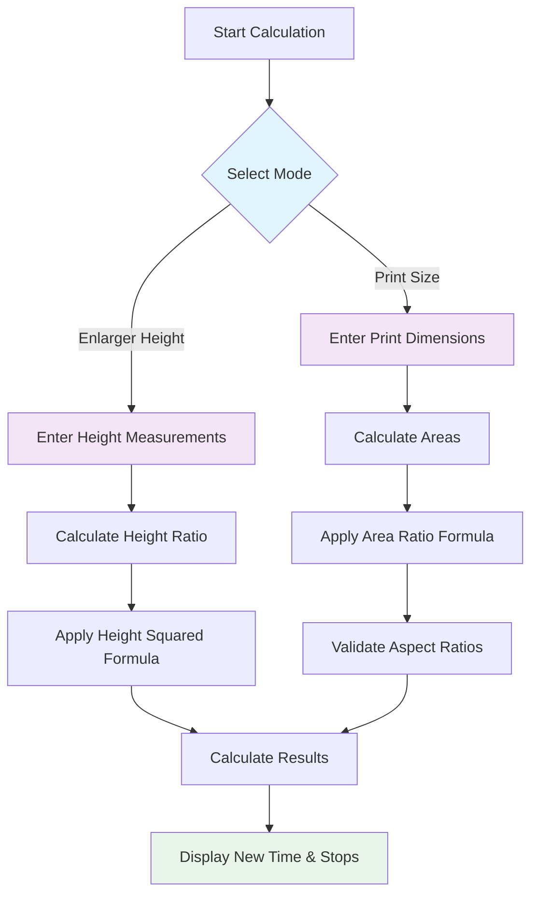
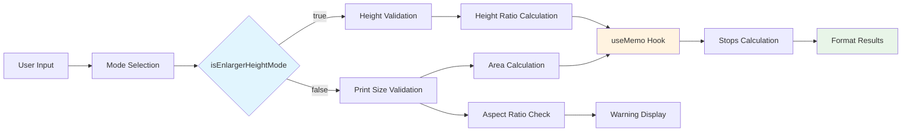
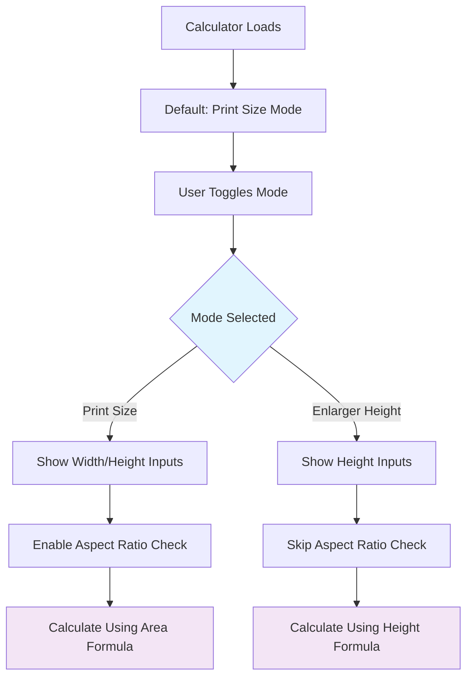

# Resize Calculator Formulas and Algorithms

## Introduction

The Resize Calculator helps determine the correct exposure time when enlarging or reducing the size of darkroom prints. It accounts for the inverse-square law of light, which affects exposure as print size changes.

The calculator supports two calculation methods:
- **Print Size Mode**: Uses actual print dimensions (easier to use)
- **Enlarger Height Mode**: Uses enlarger head height measurements (more accurate)

## Calculation Flow



## Core Formulas

### Print Size Mode (Area-Based Calculation)

This method calculates exposure changes based on the print area difference.

#### Area Calculation

The calculation begins by determining the areas of both the original and new print sizes:

- Original print area: $A_{original} = W_{original} \times H_{original}$
- New print area: $A_{new} = W_{new} \times H_{new}$

Where:

- $W_{original}$ and $H_{original}$ are the width and height of the original print in inches
- $W_{new}$ and $H_{new}$ are the width and height of the new print in inches

#### Exposure Time Calculation

The new exposure time is calculated based on the ratio of the new area to the original area:

$T_{new} = T_{original} \times \frac{A_{new}}{A_{original}}$

Where:

- $T_{original}$ is the original exposure time in seconds
- $T_{new}$ is the new exposure time in seconds
- $\frac{A_{new}}{A_{original}}$ is the area ratio

#### Aspect Ratio Validation

The calculator checks if the aspect ratios of the original and new print sizes match:

$Ratio_{original} = \frac{W_{original}}{H_{original}}$

$Ratio_{new} = \frac{W_{new}}{H_{new}}$

The aspect ratios match if: $|Ratio_{original} - Ratio_{new}| < 0.001$

If the aspect ratios don't match, a warning is displayed to indicate that the proportions of the image will be distorted.

### Enlarger Height Mode (Distance-Based Calculation)

This method uses the physical distance from the enlarger lens to the paper, providing more accurate results when properly measured.

#### Height-Based Formula

The exposure calculation is based on the inverse-square law applied directly to enlarger heights:

$T_{new} = T_{original} \times \frac{H_{new}^2}{H_{original}^2}$

Where:

- $H_{original}$ is the original enlarger height (lens to paper distance) in cm
- $H_{new}$ is the new enlarger height (lens to paper distance) in cm
- $T_{original}$ is the original exposure time in seconds
- $T_{new}$ is the new exposure time in seconds

#### Implementation Details

```javascript
const oldMagnification = originalHeight;
const newMagnification = newHeight;

const numerator = Math.pow(newMagnification, 2);
const denominator = Math.pow(oldMagnification, 2);
const ratio = numerator / denominator;

const newTimeValue = originalTime * ratio;
```

### Stops Difference Calculation

For both modes, the difference in exposure is expressed in photographic stops:

$Stops = \log_2(ratio)$

Where:

- `ratio` is either $\frac{A_{new}}{A_{original}}$ (Print Size Mode) or $\frac{H_{new}^2}{H_{original}^2}$ (Enlarger Height Mode)
- A positive stops value indicates more exposure is needed (for a larger print or greater height)
- A negative stops value indicates less exposure is needed (for a smaller print or lesser height)
- Each stop represents a doubling or halving of exposure

## Implementation Architecture



## Input Validation

### Print Size Mode Validation

Before calculating, the following validations are performed:

- All dimension inputs (width, height) must be positive numbers greater than zero
- The original exposure time must be a positive number greater than zero
- Original area must be greater than zero

```javascript
if (
  !isNaN(origWidth) &&
  !isNaN(origLength) &&
  !isNaN(newW) &&
  !isNaN(newL) &&
  !isNaN(origTime) &&
  origWidth > 0 &&
  origLength > 0 &&
  newW > 0 &&
  newL > 0 &&
  origTime > 0
) {
  // Proceed with calculation
}
```

### Enlarger Height Mode Validation

For enlarger height calculations:

- Both original and new heights must be positive numbers greater than zero
- Heights are measured in centimeters
- The original exposure time must be a positive number greater than zero

```javascript
if (
  !isNaN(origHeight) &&
  !isNaN(newH) &&
  !isNaN(origTime) &&
  origHeight > 0 &&
  newH > 0 &&
  origTime > 0
) {
  // Proceed with calculation
}
```

## Mode Selection Logic



## Precision and Formatting

- The new exposure time is rounded to one decimal place: `newTimeValue.toFixed(1)`
- The stops difference is rounded to two decimal places: `stops.toFixed(2)`
- Aspect ratio comparison uses three decimal places of precision: `ratio.toFixed(3)`

## Mathematical Background

### Inverse-Square Law

Both calculation methods are based on the inverse-square law, which in photography states that:

$E \propto \frac{1}{d^2}$

Where:

- $E$ is the illuminance (light intensity)
- $d$ is the distance from the light source

#### Print Size Mode Application

Since the area of projection is proportional to the square of the distance ($A \propto d^2$), we can rewrite this as:

$E \propto \frac{1}{A}$

To maintain the same exposure (density) in the final print, the exposure time must be adjusted inversely to the change in illuminance:

$T \propto \frac{1}{E}$

Therefore: $T \propto A$

Which gives us our print size formula: $T_{new} = T_{original} \times \frac{A_{new}}{A_{original}}$

#### Enlarger Height Mode Application

For enlarger height mode, we apply the inverse-square law directly to the distance measurements:

$T_{new} = T_{original} \times \frac{d_{new}^2}{d_{original}^2}$

Where $d$ represents the enlarger height (lens-to-paper distance).

## Performance Optimizations

The implementation uses React's `useMemo` hook to optimize calculations:

```javascript
const { newTime, stopsDifference } = useMemo(() => {
  // Calculation logic here
  return { newTime: calculatedNewTime, stopsDifference: calculatedStopsDifference };
}, [
  isEnlargerHeightMode, 
  originalWidth, 
  originalLength, 
  newWidth, 
  newLength, 
  originalTime, 
  originalHeight, 
  newHeight
]);
```

This ensures calculations only run when input values change, improving performance.

## Usage Notes

### General Guidelines

- The calculator provides a best-guess estimate and should be used as a starting point
- Test strips are still recommended when resizing prints
- When making significant size changes (more than 2 stops), consider intermediate test exposures
- The formula assumes the enlarger's light source and optical characteristics remain constant

### Mode-Specific Guidelines

#### Print Size Mode
- Easier to use - just measure your prints
- Good for most printing situations
- Warns when aspect ratios don't match
- Less accurate due to not accounting for lens characteristics

#### Enlarger Height Mode
- More accurate when properly calibrated
- Requires measuring lens-to-paper distance
- No aspect ratio concerns (prints will scale proportionally)
- Best for critical work where accuracy is paramount
- Requires consistent measurement technique

### Measurement Tips

For **Print Size Mode**:
- Measure the actual printed image area, not the paper size
- Use consistent units (inches recommended)
- Double-check aspect ratio warnings

For **Enlarger Height Mode**:
- Measure from the lens to the baseboard/paper surface
- Use centimeters for consistency
- Ensure enlarger is properly aligned and focused
- Take measurements at the same focus point
